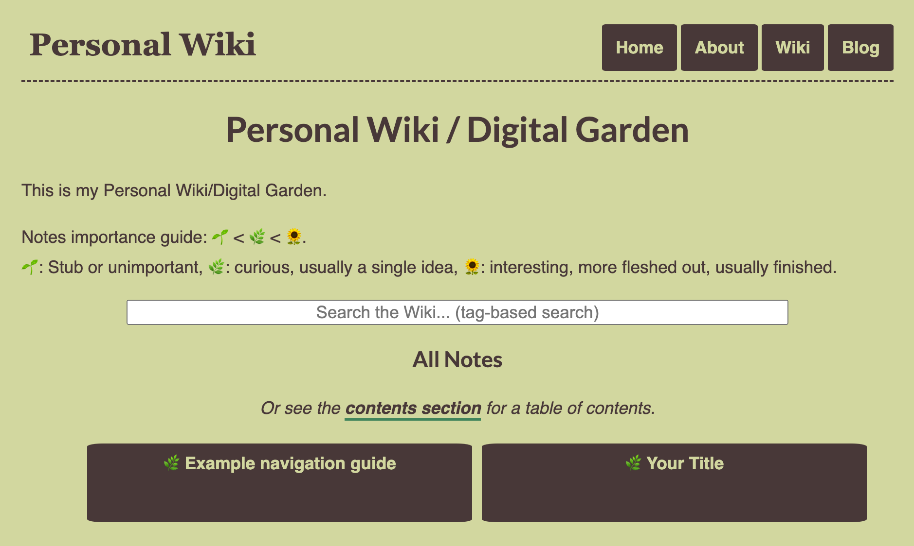

# Personal Wiki / Digital Garden and Static Blog Site Setup

This is a template for a personal site, made with GitHub pages. 



It uses jekyll, and comes with all the features you need to set up your digital garden / personal wiki (and a minimalistic blog). Available features include:

- Search (with a tagging system)
- Responsive design
- Fast loading times
- Markdown notes (easy to import or export from other tools)

Start using a note-taking system without having to invent one from scratch! Easily share your notes with other people by linking them to this site (which can be hosted for free on GitHub pages or netlify).

## Forking this repo

If you want to build your own personal wiki / personal site using this template, all you have to do is:

- Fork this repo.
- Set up the values in `_config.yml` for your twitter username and Google Analytics ID.
- In the folder `wiki` you can put your own markdown notes, setting them with a title, tags and description. Use the example template as reference.
- Markdowns in the `_posts` folder it follow the same format, but their names must start with a date in format YYYY-MM-DD.
- Go to `_layouts` to see the HTML templates for each page kind. You can fiddle around with them.
- Customize `wiki/index.html`, the `index.html` on base directory (homepage) and `about/index.md`, as they are supposed to contain a personal description. Also update the social networking links on `_layouts/default.html`'s footer so they point to your networks. These include support for fontawesome icons. In that footer is also a path to the default twitter image, though each article or post can have its own image (specified in header).
- To change up the style, just edit `css/main.css` and run `minify_css.sh` to minify (or change the default layout to import the unminified css instead). You can find many good CSS templates that are free in this [Free Jekyll Themes Gallery](https://jekyllthemes.io/free).

To run the site locally, run

```
sudo gem install rails
sudo gem install jekyll
sudo gem install jekyll bundler
cd ~/this_project

bundle init
bundle install
bundle add jekyll
bundle exec jekyll serve
```
